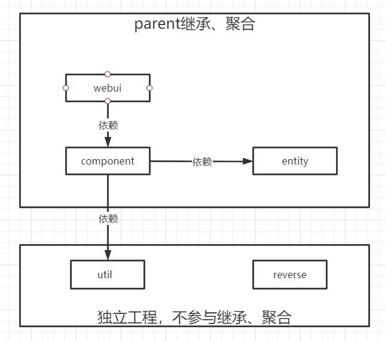
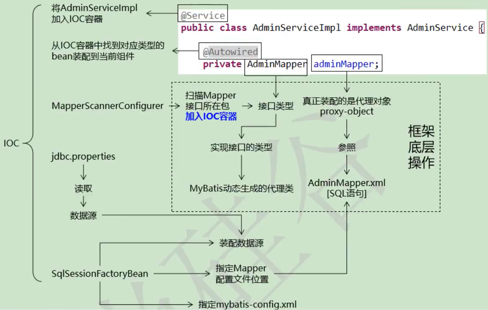
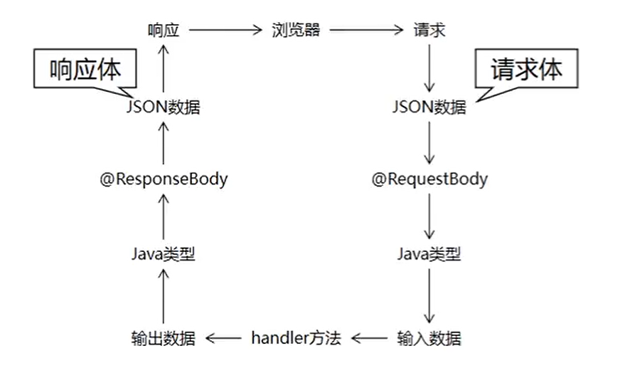
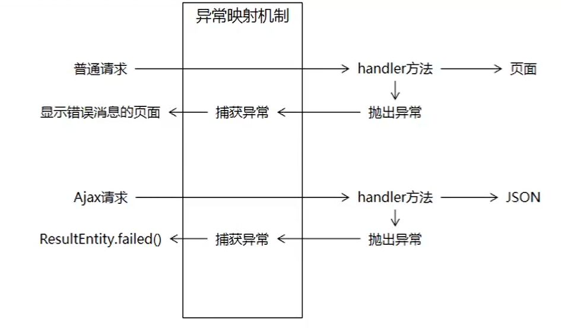

# 1. 项目简介

项目是一个在线众筹平台通过向普通大众募集资金来支持创业项目，支持者可以获得与支持金额相当的回报。项目主要是从单一架构到分布式架构的过渡阶段，适合学完SSM框架后，需要通过一个项目巩固所学知识技能，并平滑过渡到分布式开发的小伙伴。 

整个课程分后台管理系统和前台会员系统两部分： 

> 1.后台管理系统是基于SSM整合的单一架构 
>
> 2.前台会员系统是基于SpringBoot+SpringCloud的微服务架构

项目我是在b站看尚硅谷的视频学习哒，因为我本人Java也只是学习到了SSM，为了更好的过渡到分布式，就拿这个项目练手了，大家感兴趣的可以[戳这](https://www.bilibili.com/video/BV1bE411T7oZ?spm_id_from=333.788.b_636f6d6d656e74.31)，老师讲的很好，不仅讲整个项目怎么做的，还会讲一些做项目的经验，比起项目本身，我觉得在这次做项目过程中遇见的问题是我收获最大的东西。

下面是我整理的一些项目相关的笔记。（老师分析的时候按照目标-思路-编码流程来分析的，我记笔记的时候并不是严格按照这个思路来记的。）

# 2. 项目架构




# 3. 数据库与逆向工程

## 3.1 数据库建表

```sql
CREATE DATABASE project_rowd CHARACTER SET utf8;

USE project_rowd;
drop table if exists t_admin;				# 如果存在t_admin则删除存在的表
    CREATE TABLE t_admin (
    id INT NOT NULL auto_increment,			# 主键
    login_acct VARCHAR ( 255 ) NOT NULL,	# 登录账号
    user_pswd CHAR ( 32 ) NOT NULL,			# 登录密码
    user_name VARCHAR ( 255 ) NOT NULL,		# 昵称
    email VARCHAR ( 255 ) NOT NULL,			# 邮件地址
    create_time CHAR ( 19 ),				# 创建时间
    PRIMARY KEY ( id ) 						# 设置主键
);
```

## 3.2 依赖

```xml
<!-- 控制Maven在构建过程中的相关配置 -->
<build>
    <plugins>
        <plugin>
            <groupId>org.mybatis.generator</groupId>
            <artifactId>mybatis-generator-maven-plugin</artifactId>
            <version>1.3.0</version>

            <dependencies>
                <!-- 逆向工程核心依赖 -->
                <dependency>
                    <groupId>org.mybatis.generator</groupId>
                    <artifactId>mybatis-generator-core</artifactId>
                    <version>1.3.2</version>
                </dependency>
                <dependency>
                    <groupId>com.mchange</groupId>
                    <artifactId>c3p0</artifactId>
                    <version>0.9.2</version>
                </dependency>
                <!--MySQL驱动-->
                <dependency>
                    <groupId>mysql</groupId>
                    <artifactId>mysql-connector-java</artifactId>
                    <version>8.0.15</version>
                </dependency>
            </dependencies>
        </plugin>
    </plugins>
</build>
```

## 3.3 配置文件

generatorConfig.xml

```xml
<?xml version="1.0" encoding="UTF-8"?>
<!DOCTYPE generatorConfiguration
        PUBLIC "-//mybatis.org//DTD MyBatis Generator Configuration 1.0//EN"
        "http://mybatis.org/dtd/mybatis-generator-config_1_0.dtd">

<generatorConfiguration>
    <context id="atguiguTables" targetRuntime="MyBatis3">
        <commentGenerator>
            <!-- 是否去除自动生成的注释 true：是 ： false:否 -->
            <property name="suppressAllComments" value="true" />
        </commentGenerator>

        <!-- 数据库链接URL、用户名、密码 -->
        <jdbcConnection
                driverClass="com.mysql.cj.jdbc.Driver"
                connectionURL="jdbc:mysql://localhost:3306/project_rowd?serverTimezone=UTC"
                userId="root"
                password="12345">
        </jdbcConnection>

        <!--
        	默认false，把JDBC DECIMAL 和 NUMERIC 类型解析为 Integer
            true，把JDBC DECIMAL 和 NUMERIC 类型解析为java.math.BigDecimal
        -->
        <javaTypeResolver>
            <property name="forceBigDecimals" value="false" />
        </javaTypeResolver>

        <!--
       	 	生成model模型，对应的包路径，以及文件存放路径(targetProject)，targetProject可以指定具体的路径,如./src/main/java，
        	也可以使用“MAVEN”来自动生成，这样生成的代码会在target/generatord-source目录下
        -->
        <!--<javaModelGenerator targetPackage="com.joey.mybaties.test.pojo" targetProject="MAVEN">-->
        <javaModelGenerator targetPackage="cn.melonseed.crowd.entity" targetProject=".\src\main\java">
            <!--是否让schema作为包的后缀-->
            <property name="enableSubPackages" value="false"/>
            <!-- 从数据库返回的值被清理前后的空格  -->
            <property name="trimStrings" value="true" />
        </javaModelGenerator>

        <!--对应的mapper.xml文件  -->
        <sqlMapGenerator targetPackage="cn.melonseed.crowd.mapper" targetProject=".\src\main\java">
            <!--是否让schema作为包的后缀-->
            <property name="enableSubPackages" value="false"/>
        </sqlMapGenerator>

        <!-- 对应的Mapper接口类文件 -->
        <javaClientGenerator type="XMLMAPPER" targetPackage="cn.melonseed.crowd.mapper" targetProject=".\src\main\java">
            <!--是否让schema作为包的后缀-->
            <property name="enableSubPackages" value="false"/>
        </javaClientGenerator>

        <!-- 数据库表名与需要的实体类对应映射的指定 -->
        <table tableName="t_admin" domainObjectName="Admin"/>
    </context>
</generatorConfiguration>
```

## 3.4 命令

逆向工程命令：

> mybatis-generator:generate

# 4. 父工程依赖管理

## 4.1版本申明

方便后续版本修改的时候，在这里改版本就行了。

**一处修改，处处生效。**

><!--通过properties标签指定一些需要重用的版本号，方便在后面调用-->
>
><!--一处修改，处处生效-->
>
><properties>
>    <fall.spring.version>4.3.20.RELEASE</fall.spring.version>
>    <fall.spring.security.version>4.2.10.RELEASE</fall.spring.security.version>
></properties>

## 4.2版本管理

> <!--依赖管理-->
> <dependencyManagement>
>     <dependencies>
>
>  <!-- Spring 依赖 -->
>   <!-- https://mvnrepository.com/artifact/org.springframework/spring-orm -->
>     <dependency>
>         <groupId>org.springframework</groupId>
>         <artifactId>spring-orm</artifactId>
>         <version>${fall.spring.version}</version>
>     </dependency>
>     <!-- https://mvnrepository.com/artifact/org.springframework/spring-webmvc -->
>     <dependency>
>         <groupId>org.springframework</groupId>
>         <artifactId>spring-webmvc</artifactId>
>         <version>${fall.spring.version}</version>
>     </dependency>
>     <dependency>
>         <groupId>org.springframework</groupId>
>         <artifactId>spring-test</artifactId>
>         <version>${fall.spring.version}</version>
>     </dependency>
>     <!-- Spring AOP -->
>     <!-- https://mvnrepository.com/artifact/org.aspectj/aspectjweaver -->
>     <dependency>
>         <groupId>org.aspectj</groupId>
>         <artifactId>aspectjweaver</artifactId>
>         <version>1.9.2</version>
>     </dependency>
>     <!-- https://mvnrepository.com/artifact/cglib/cglib -->
>     <dependency>
>         <groupId>cglib</groupId>
>         <artifactId>cglib</artifactId>
>         <version>2.2</version>
>     </dependency>
>
> ​	<!-- 数据库依赖 -->
> ​	<!-- MySQL 驱动 -->
> ​	<dependency>
>    ​	 <groupId>mysql</groupId>
>    ​	 <artifactId>mysql-connector-java</artifactId>
>    ​	 <version>8.0.15</version>
> ​	</dependency>
> ​	<!-- 数据源 -->
> ​	<dependency>
>    ​	 <groupId>com.alibaba</groupId>
>    ​	 <artifactId>druid</artifactId>
>    ​	<version>1.1.17</version>
> ​	</dependency>
> ​	<!-- MyBatis -->
> ​	<dependency>
>    ​	 <groupId>org.mybatis</groupId>
> ​    	<artifactId>mybatis</artifactId>
> ​    	<version>3.2.8</version>
> ​	</dependency>
> ​	<!-- MyBatis 与 Spring 整合 -->
> ​	<dependency>
>  ​	   <groupId>org.mybatis</groupId>
>   ​	  <artifactId>mybatis-spring</artifactId>
>   ​	  <version>1.2.2</version>
> ​	</dependency>
> ​	<!-- MyBatis 分页插件 -->
> ​	<dependency>
>   ​	  <groupId>com.github.pagehelper</groupId>
>   ​	  <artifactId>pagehelper</artifactId>
> ​    	<version>4.0.0</version>
> ​	</dependency>
>
> ​	<!-- 日志 -->
> ​	<dependency>
>  ​	   <groupId>org.slf4j</groupId>
>    ​	 <artifactId>slf4j-api</artifactId>
>    ​	 <version>1.7.7</version>
> ​	</dependency>
> ​	<dependency>
> ​	    <groupId>ch.qos.logback</groupId>
>  ​	   <artifactId>logback-classic</artifactId>
>  ​	   <version>1.2.3</version>
> ​	</dependency>
> ​	<!-- 其他日志框架的中间转换包 -->
> ​	<dependency>
> ​	    <groupId>org.slf4j</groupId>
> ​	    <artifactId>jcl-over-slf4j</artifactId>
>  ​	   <version>1.7.25</version>
> ​	</dependency>
> ​	<dependency>
> ​	    <groupId>org.slf4j</groupId>
>  ​	   <artifactId>jul-to-slf4j</artifactId>
>   ​	  <version>1.7.25</version>
> ​	</dependency>
>
> ​	<!-- Spring 进行 JSON 数据转换依赖 -->
> ​	<dependency>
>   ​	  <groupId>com.fasterxml.jackson.core</groupId>
>   ​	  <artifactId>jackson-core</artifactId>
>  ​	   <version>2.11.0</version>
> ​	</dependency>
> ​	<dependency>
>   ​	  <groupId>com.fasterxml.jackson.core</groupId>
> ​	    <artifactId>jackson-databind</artifactId>
> ​    <version>2.11.0</version>
> ​	</dependency>
>
> ​	<!-- JSTL 标签库 -->
> ​	<dependency>
>    ​	 <groupId>jstl</groupId>
>    ​	 <artifactId>jstl</artifactId>
>    ​	 <version>1.2</version>
> ​	</dependency>
>
> ​	<!-- junit 测试 -->
> ​	<dependency>
> ​    	<groupId>junit</groupId>
> ​    	<artifactId>junit</artifactId>
> ​    	<version>4.12</version>
> ​    	<scope>test</scope>
> ​	</dependency>
>
> ​	<!-- 引入 Servlet 容器中相关依赖 -->
> ​	<dependency>
>    ​	 <groupId>javax.servlet</groupId>
>    ​	 <artifactId>servlet-api</artifactId>
>    ​	<version>2.5</version>
>    ​	 <scope>provided</scope>
> ​	</dependency>
>
> ​	<!-- JSP 页面使用的依赖 -->
> ​	<dependency>
>   ​	  <groupId>javax.servlet.jsp</groupId>
>    ​	 <artifactId>jsp-api</artifactId>
>    ​	 <version>2.1.3-b06</version>
>    ​	 <scope>provided</scope>
> ​	</dependency>
> ​	<!-- https://mvnrepository.com/artifact/com.google.code.gson/gson -->
> ​	<dependency>
>   ​	  <groupId>com.google.code.gson</groupId>
> ​    	<artifactId>gson</artifactId>
>    ​	 <version>2.8.5</version>
> ​	</dependency>
>
> ​	<!-- SpringSecurity 对 Web 应用进行权限管理 -->
> ​	<dependency>
>  ​	   <groupId>org.springframework.security</groupId>
>   ​	  <artifactId>spring-security-web</artifactId>
>   ​	  <version>${fall.spring.security.version}</version>
> ​	</dependency>
> ​	<!-- SpringSecurity 配置 -->
> ​	<dependency>
> ​    	<groupId>org.springframework.security</groupId>
> ​    	<artifactId>spring-security-config</artifactId>
> ​    	<version>${fall.spring.security.version}</version>
> ​	</dependency>
> ​	<!-- SpringSecurity 标签库 -->
> ​	<dependency>
>  ​	   <groupId>org.springframework.security</groupId>
>   ​	  <artifactId>spring-security-taglibs</artifactId>
>  ​	   <version>${fall.spring.security.version}</version>
> ​	</dependency>
>
> </dependencies>
>
> </dependencyManagement>

## 4.3依赖信息来源

>网站： https://mvnrepository.com
>
>根据实际运行，确认jar包之间的兼容
>
>SpringMVC需要jackson的支持处理JSON数据，但是SpringMVC并没有依赖jackson，我们需要保证jar包之间兼容性。

# 5.Spring整合Mybatis

## 5.1 思路




## 5.2 操作清单

1. 在子工程中加入搭建环境所需要的具体依赖

2. 准备 jdbc.properties

3. 创建Spring配置文件专门配置 Spring和 MyBatis整合相关

4. 在 Spring的配置文件中加载jdbc.properties属性文件

5. 配置数据源

6. 测试从数据源中获取数据库连接

7. 配置 SqlSessionFactoryBean

   > 装配数据源
   > 指定XxxMapper.xml配置文件的位置
   > 指定MyBatis全局配置文件的位置（可选)

8. 配置 MapperScannerConfigurer
9. 测试是否可以装配XxxMapper接口并通过这个接口操作数据库

## 5.3 操作步骤


# 6. 日志配置

> System.out本质是一个IO操作，通常IO操作比较消耗性能。
>
> 这里使用**slf4j+logback**代替Spring默认使用的commons-loggin日志包。

## 6.1 添加依赖

component中添加依赖

```xml
<!-- 日志 -->
<dependency>
    <groupId>org.slf4j</groupId>
    <artifactId>slf4j-api</artifactId>
</dependency>
<dependency>
    <groupId>ch.qos.logback</groupId>
    <artifactId>logback-classic</artifactId>
</dependency>
<!-- 其他日志框架的中间转换包 -->
<dependency>
    <groupId>org.slf4j</groupId>
    <artifactId>jcl-over-slf4j</artifactId>
</dependency>
<dependency>
    <groupId>org.slf4j</groupId>
    <artifactId>jul-to-slf4j</artifactId>
</dependency>
```

## 6.2 日志打印

```java
	@Test
	public void testLog(){
	    //获取Logger对象，这里传入的Class就是当前打印日志的类
	    Logger logger = LoggerFactory.getLogger(CrowdTest.class);
	    //等级 DEBUG < INFO < WARN < ERROR
	    logger.debug("I am DEBUG!!!");

	    logger.info("I am INFO!!!");

	    logger.warn("I am WARN!!!");

	    logger.error("I am ERROR!!!");

	}
```

## 6.3 配置文件

logback.xml

```xml
<?xml version="1.0" encoding="UTF-8"?>
<configuration debug="true">
    <!-- 指定日志输出的位置 -->
    <appender name="STDOUT" class="ch.qos.logback.core.ConsoleAppender">
        <encoder>
            <!-- 日志输出的格式 -->
            <!-- 按照顺序分别是： 时间、 日志级别、 线程名称、 打印日志的类、 日志主体
            内容、 换行 -->
            <pattern>[%d{HH:mm:ss.SSS}] [%-5level] [%-8thread] [%logger] [%msg]%n</pattern>
        </encoder>
    </appender>
    <!-- 设置全局日志级别。 日志级别按顺序分别是： DEBUG、 INFO、 WARN、 ERROR -->
    <!-- 指定任何一个日志级别都只打印当前级别和后面级别的日志。 -->
    <root level="INFO">
        <!-- 指定打印日志的 appender， 这里通过"STDOUT"引用了前面配置的 appender -->
        <appender-ref ref="STDOUT" />
    </root>
    <!-- 根据特殊需求指定局部日志级别 -->
    <logger name="org.fall.mapper" level="DEBUG"/>
</configuration>

```

# 7. 声明式事务

## 7.1 目标

把下面一系列操作交由框架实现。

```
try{
	//开启事务(关闭自动提交)
	connection.setAutoCommit(false);         //前置通知
	//核心操作
	adminService.saveAdmin(admin);
	//提交事务
	connection.commit();					 //返回通知
} catch(Exception e){
	//回滚事务
	connection.rollback();                   //异常通知
} finally{
	//释放数据库连接
	if(判空){
		connection.close();                  //后置通知
	}
}
```

> 注解：@Transaction
>
> AOP切面编程

## 7.2 思路

> 1. 选择合适的事务管理器
> 2. 配置AOP
> 3. 配置事务属性

## 7.3 依赖

```xml
<!-- Spring AOP -->
<dependency>
    <groupId>org.aspectj</groupId>
    <artifactId>aspectjweaver</artifactId>
</dependency>

<dependency>
    <groupId>cglib</groupId>
    <artifactId>cglib</artifactId>
</dependency>
```

## 7.4 配置文件

**spring-persist-tx.xml**

```xml
<?xml version="1.0" encoding="UTF-8"?>
<beans xmlns="http://www.springframework.org/schema/beans"
       xmlns:xsi="http://www.w3.org/2001/XMLSchema-instance" xmlns:aop="http://www.springframework.org/schema/aop"
       xmlns:tx="http://www.springframework.org/schema/tx" xmlns:context="http://www.springframework.org/schema/context"
       xsi:schemaLocation="http://www.springframework.org/schema/beans http://www.springframework.org/schema/beans/spring-beans.xsd http://www.springframework.org/schema/aop http://www.springframework.org/schema/aop/spring-aop.xsd http://www.springframework.org/schema/tx http://www.springframework.org/schema/tx/spring-tx.xsd http://www.springframework.org/schema/context http://www.springframework.org/schema/context/spring-context.xsd">

    <!--配置自动扫描的包-->
    <context:component-scan base-package="org.fall.service"/>

    <!--配置事务管理器-->
    <bean id="txManager" class="org.springframework.jdbc.datasource.DataSourceTransactionManager">
        <property name="dataSource" ref="dataSource"/>
    </bean>
    
    <!--配置AOP-->
    <aop:config>
        <!--配置切入点表达式-->
        <aop:pointcut id="txPointcut" expression="execution(* *..*ServiceImpl.*(..))"/>

        <!--关联事务通知与切入点-->
        <aop:advisor advice-ref="txAdvice" pointcut-ref="txPointcut"/>
    </aop:config>

    <!--配置事务通知-->
    <tx:advice id="txAdvice" transaction-manager="txManager">
        <tx:attributes>
            <!--name属性指定当前要配置的事务方法的方法名，符合名字的配置对应规则-->
            <!--查询方法通常设置为只读，便于数据库根据只读属性进行性能优化-->
            <tx:method name="get*" read-only="true"/>
            <tx:method name="query*" read-only="true"/>
            <tx:method name="find*" read-only="true"/>
            <tx:method name="count*" read-only="true"/>

            <!--涉及增删改查操作的方法的配置-->
            <!--propagation属性配置事务方法的传播行为-->
                <!--
                    默认行为：REQUIRED，表示当前方法必须运行在事务中，如果没有事务，则开启事务，在自己的事务中运行。
                        如果已经有了已开启的事务，则在当前事务中运行。有可能和其他方法共用同一个事务
                    建议设置：REQUIRES_NEW，表示当前方法必须运行在事务中，如果没有事务，则开启事务，在自己的事务中运行。
                        和 REQUIRED 的区别是就算现在已经有了已开启的事务，也一定要开启自己的事务，避免和其他方法共用同一个事务。
                -->
            <!--rollback-for：表示触发什么异常时，进行回滚；默认值：运行时异常，建议设置为运行时异常+编译期异常-->
            <tx:method name="save*" propagation="REQUIRES_NEW" rollback-for="java.lang.Exception"/>
            <tx:method name="update*" propagation="REQUIRES_NEW" rollback-for="java.lang.Exception"/>
            <tx:method name="remove*" propagation="REQUIRES_NEW" rollback-for="java.lang.Exception"/>
			 <tx:method name="batch*" propagation="REQUIRES_NEW" rollback-for="java.lang.Exception"/>
        </tx:attributes>
    </tx:advice>

    <!-- 将BCryptPasswordEncoder装配入IOC容器 -->
    <bean class="org.springframework.security.crypto.bcrypt.BCryptPasswordEncoder" id="passwordEncoder"/>

</beans>
```

# 8. 表述层

## 8.1 依赖

```xml
	<dependency>
		<groupId>javax.servlet</groupId>
		<artifactId>servlet-api</artifactId>
		<scope>provided</scope>
	</dependency>
	<dependency>
		<groupId>javax.servlet.jsp</groupId>
		<artifactId>jsp-api</artifactId>
		<scope>provided</scope>
	</dependency>

	<dependency>
    	<groupId>org.springframework</groupId>
    	<artifactId>spring-webmvc</artifactId>
	</dependency>
```


## 8.2 web.xml配置

```xml
<?xml version="1.0" encoding="UTF-8"?>
<web-app xmlns="http://xmlns.jcp.org/xml/ns/javaee"
         xmlns:xsi="http://www.w3.org/2001/XMLSchema-instance"
         xsi:schemaLocation="http://xmlns.jcp.org/xml/ns/javaee http://xmlns.jcp.org/xml/ns/javaee/web-app_4_0.xsd"
         version="4.0">

    <!--配置ContextLoaderListener，加载Spring配置文件-->
    <!--contextConfigLocation需要的内容-->
    <context-param>
        <param-name>contextConfigLocation</param-name>
        <param-value>classpath:spring-persist-*.xml</param-value>
    </context-param>
    <!--将ContextLoaderListener加入容器-->
    <listener>
        <listener-class>org.springframework.web.context.ContextLoaderListener</listener-class>
    </listener>

    <!--配置CharacterEncodingFilter，解决乱码问题-->
    <!--如果web.xml中存在多个Filter，则此Filter必须作为过滤器链的第一个Filter-->
    <filter>
        <filter-name>characterEncodingFilter</filter-name>
        <filter-class>org.springframework.web.filter.CharacterEncodingFilter</filter-class>
        <!-- 指定字符集编码 -->
        <init-param>
            <param-name>encoding</param-name>
            <param-value>UTF-8</param-value>
        </init-param>
        <!--强制请求进行编码-->
        <init-param>
            <param-name>forceRequestEncoding</param-name>
            <param-value>true</param-value>
        </init-param>
        <!--强制响应进行编码-->
        <init-param>
            <param-name>forceResponseEncoding</param-name>
            <param-value>true</param-value>
        </init-param>
    </filter>
    <!--这个Filter执行顺序必须在其他Filter前面-->
    <!--设置过滤器过滤的请求的路径（/*表示全部请求）-->
    <filter-mapping>
        <filter-name>characterEncodingFilter</filter-name>
        <url-pattern>/*</url-pattern>
    </filter-mapping>

    <!--配置DispatcherServlet（即配置SpringMVC的前端控制器）-->
    <servlet>
        <servlet-name>dispatcherServlet</servlet-name>
        <servlet-class>org.springframework.web.servlet.DispatcherServlet</servlet-class>
        <!--指定SpringMVC配置文件-->
        <init-param>
            <param-name>contextConfigLocation</param-name>
            <param-value>classpath:spring-web-mvc.xml</param-value>
        </init-param>

        <!--使DispatcherServlet在Web应用启动时就创建对象并初始化-->
        <!--DispatcherServlet在创建对象后有大量的框架初始化工作-->
        <load-on-startup>1</load-on-startup>
    </servlet>
    <servlet-mapping>
        <servlet-name>dispatcherServlet</servlet-name>
        <!--根据请求的扩展名决定是否交给SpringMVC来处理-->
        <!--
			请求的扩展名应与预计的响应体格式相同
			要求json数据则后缀.json;	要求页面则后缀.html
		-->
        <url-pattern>*.html</url-pattern>
        <url-pattern>*.json</url-pattern>
    </servlet-mapping>
</web-app>
```


## 8.3 SpringMVC配置

```xml
<!--配置包扫描，这里将controller层放在mvc包下，因此配置扫描mvc-->
<context:component-scan base-package="org.fall.mvc"/>

<!--配置视图解析器-->
<bean class="org.springframework.web.servlet.view.InternalResourceViewResolver">
    <property name="prefix" value="/WEB-INF/"/>
    <property name="suffix" value=".jsp"/>
</bean>

<!--启动注解驱动-->
<mvc:annotation-driven/>
```

## 8.4 SSM整合测试

Controller

```java
@Controller
public class TestHandler {

    @Autowired
    AdminService adminService;

    @RequestMapping("/test/ssm.html")
    public String testSSM(Model model){
        //Admin admin = adminService.queryAdmin(1);
        List<Admin> admins = adminService.getAll();
        model.addAttribute("admins", admins);
        return "target";
    }
}
```

index.jsp

```jsp
<%@ page language="java" contentType="text/html; charset=UTF-8"
    pageEncoding="UTF-8"%>
<!DOCTYPE html>
<html>
<head>
<meta charset="ISO-8859-1">
<title>Insert title here</title>
</head>
<body>
	<a href="${pageContext.request.contextPath}/test/ssm.html">测试整合SSM环境</a>
</body>
</html>
```

## 8.5 Base标签

index.jsp

```jsp
<%@ page language="java" contentType="text/html; charset=UTF-8"
    pageEncoding="UTF-8"%>
<!DOCTYPE html>
<html>
<head>
<meta charset="ISO-8859-1">
<title>Insert title here</title>
<base href="http://${pageContext.request.serverName}:${pageContext.request.serverPort}${pageContext.request.contextPath}/">	
</head>
<body>
	<a href="test/ssm.html">测试整合SSM环境</a>
</body>
</html>
```

**Base标签的要求：**	

> 		1. base 标签必须写在 head 标签内部
>   		2. base 标签必须在所有“带具体路径”的标签的前面	    
>   		3. serverName 部分 EL 表达式和 serverPort 部分 EL 表达式之间必须写“:”
>   		4. serverPort 部分 EL 表达式和 contextPath 部分 EL 表达式之间绝对不能写“/”
>   	 ​    	
>
> **原因：contextPath 部分 EL 表达式本身就是“/”开头，如果多写一个“/”会干扰 Cookie 的工作机制,serverPort 部分 EL 表达式后面必须写“/”**

# 9. Ajax



## 9.1 依赖

```xml
<!-- Spring 进行 JSON 数据转换依赖 -->
<dependency>
    <groupId>com.fasterxml.jackson.core</groupId>
    <artifactId>jackson-core</artifactId>
</dependency>
<dependency>
    <groupId>com.fasterxml.jackson.core</groupId>
    <artifactId>jackson-databind</artifactId>
</dependency>
```

## 9.2 加入jQuery

​	引入jQuery。

```jsp
<script src="jquery/jquery-3.4.1.js" type="text/javascript"></script>
```

## 9.3 测试

```jsp
<script type="text/javascript">
    $(function () {

        //btn1
        //此方式可以在浏览器看到发送的请求体是Form Data(表单数据)
        $("#btn1").click(function () {
            $.ajax({
                url: "send/array/one.html",         //请求目标资源地址
                type: "post",                       //请求方式
                data: {
                	array:[1, 2, 3]
                } ,                    //发送的请求参数
                dataType: "text",                   //表示如何对待服务器返回的数据
                success: function (response) {
                    alert(response);
                },
                error: function (response) {
                    alert(response);
                }

            });
        });
		//btn2省略，需要一个专门的类来封装数组，太麻烦了。
        //btn3
        //此方式可以在浏览器看到发送的请求体是Request Payload(请求负载)
        $("#btn2").click(function () {
            //准备要发送的数据
            var array=[5,8,12];
            //必须先将目标转换成JSON字符串
            var arrayJSON = JSON.stringify(array);
            $.ajax({
                url: "send/array/two.html",         
                type: "post",                       
                data: arrayJSON,                     
                dataType: "text",                   
                contentType: "application/json;charset=UTF-8",  //告诉服务器端当前请求的请求体是JSON格式
                success: function (response) {
                    alert(response);
                },
                error: function (response) {
                    alert(response);
                }

            });
        });      
    });
</script>
```

测试4个button按钮：

```jsp
<button id="btn1">Test Ajax One</button>
<br/><br/>
<button id="btn2">Test Ajax Two</button>
<br/><br/>
<button id="btn3">Test Compose Object</button>
```

handler

通过@RequestParam接收数组

```java
//通过@RequestParam接收数组
    @ResponseBody
    @RequestMapping("/send/array/one.html")
    public String testAjax01(@RequestParam("array[]") Integer[] array){
        for(Integer num : array){
            System.out.println("num:"+num);
        }
        return "success";
    }
```

**缺陷：接收数据时需要多写一组“[]”.**

通过@RequestBody接收数组

```java
//通过@RequestBody接收数组
    @ResponseBody
    @RequestMapping("/send/array/two.html")
    public String testAjax02(@RequestBody Integer[] array){
        for(Integer num : array){
            System.out.println("num:"+num);
        }
        return "success";
    }
```

## 9.4 规范Ajax请求

ResultType<T>.java

```java
/**  
* Title: ResultEntity.java  
* Description:   
* @author MelonSeed
* @date 2021年5月25日  
* @version 1.0  
*/
package cn.melonseed.crowd.util;

/**  
* Title: ResultEntity 
* Description:  统一整个项目Ajax请求返回结果，分布式架构也会用到。
* @author MelonSeed
* @date 2021年5月25日  
*/
public class ResultEntity<T> {
	//设置两个常量
    public static final String SUCCESS = "SUCCESS";
    public static final String FAILED = "FAILED";

    //请求错误时，返回的错误信息，对应SUCCESS与FAILED
    private String message;

    //要返回的数据
    private T data;

    //封装当前请求的处理结果是成功还是失败
    private String result;

    

    /**
	 * 
	 */
	public ResultEntity() {
			
	}

	/**
	 * @param message
	 * @param data
	 * @param result
	 */
	public ResultEntity(String message, T data, String result) {
		super();
		this.message = message;
		this.data = data;
		this.result = result;
	}
	//请求处理成功并且不向前端返回数据时，使用的静态方法
    //第一个<Type>表示声明一个泛型Type，第二个和return中的<Type>表示使用该泛型
    public static <Type> ResultEntity<Type> successWithoutData(){
        return new ResultEntity<Type>(null,null,SUCCESS);
    }
    
	//请求处理成功并且向前端返回数据时，使用的静态方法
    public static <Type> ResultEntity<Type> successWithData(Type data){
        return new ResultEntity<Type>(null,data,SUCCESS);
    }
    
	//请求处理失败，需要返回错误信息时，使用的静态方法
    public static <Type> ResultEntity<Type> failed(String message){
        return new ResultEntity<Type>(message,null,FAILED);
    }
	
}
//省略了set、get方法。
```

# 10. 异常映射



## 10.1 工具方法

先加依赖

```xml
<dependency>
    <groupId>javax.servlet</groupId>
    <artifactId>servlet-api</artifactId>
    <version>2.5</version>
    <scope>provided</scope>
</dependency>
```

CrowdUtils.java

判断请求是普通请求还是ajax请求

```java
public class CrowdUtil {
    public static boolean judgeRequestType(HttpServletRequest request){
        //获取请求消息头
    	String accept = request.getHeader("Accept");
        String header = request.getHeader("X-Requested-With");
        //判断
        return (accept != null && accept.contains("application/json"))
                ||(header != null && header.equals("XMLHttpRequest"));
    }
}
```

## 10.2 实现

### 10.2.1 基于XML的异常映射

```xml
<!--基于XML的异常映射-->
<bean class="org.springframework.web.servlet.handler.SimpleMappingExceptionResolver" id="simpleMappingExceptionResolver">
    <property name="exceptionMappings">
        <props>
            <prop key="java.lang.Exception">system-error</prop>
        </props>
    </property>
</bean>
```

### 10.2.2 基于注解的异常映射

CrowdExceptionResolver.java

一个异常类型对应一个方法

```java
//注解标明该类是基于注解的异常处理器类
@ControllerAdvice
public class CrowdExceptionResolver {

    //处理空指针异常
    @ExceptionHandler(value = {NullPointerException.class})
    public ModelAndView resolveNullPointerException(NullPointerException exception,
            HttpServletRequest request, HttpServletResponse response
    ) throws IOException {
        return commonCode(exception,request,response,"system-error");
    }

    //处理数学异常,这里如果内部操作相同，跳转页面也相同，其实可以放在上面一个方法中，此处只是为了演示
    @ExceptionHandler(value = {ArithmeticException.class})
    public ModelAndView resolveArithmeticException(ArithmeticException exception,
            HttpServletRequest request,HttpServletResponse response) throws IOException {
        return commonCode(exception,request,response,"system-error");

    }
    
    //整理出的不同异常的可重用代码
    private ModelAndView commonCode(
            //触发的异常，此处借助多态
            Exception exception,
            //客户器端的请求
            HttpServletRequest request,
            //服务端的响应
            HttpServletResponse response,
            //指定普通页面请求时，去的错误页面
            String viewName
    ) throws IOException {
        boolean judgeRequestType = CrowdUtil.judgeRequestType(request);
        if (judgeRequestType){
            //if判断-是json请求
            ResultEntity<Object> failed = ResultEntity.failed(exception.getMessage());
            //创建Gson对象
            Gson gson = new Gson();
            //将ResultEntity对象转换成json格式
            String json = gson.toJson(failed);
            //通过原生servlet的response传回异常内容
            response.getWriter().write(json);
            //此时只需要返回null（因为是通过json格式返回数据）
            return null;
        } else {
            //if判断-是普通页面请求
            //创建ModelAndView对象
            ModelAndView modelAndView = new ModelAndView();
            //设置触发异常跳转的页面（会自动被视图解析器加上前后缀）
            modelAndView.setViewName(viewName);
            //将异常信息加入
            modelAndView.addObject(CrowdConstant.ATTR_NAME_EXCEPTION, exception);
            //返回设置完成的ModelAndView
            return modelAndView;
        }
    }

}
```

# 11. 类管理常量

CrowdConstant.java

```java
public class CrowdConstant {
	 
	public static final String MESSAGE_LOGIN_FAILED = "抱歉！账号密码错误，请重新输入！";
	public static final String MESSAGE_LOGIN_ACCT_ALREADY_IN_USE_STRING = "抱歉！此账号已被使用！";
	public static final String MESSAGE_LOGIN_FORBIDEN = "请稍后登录！";
	public static final String ATTR_NAME_EXCEPTION = "exception";
}
```

# 12. 加入前端页面

将静态资源文件和CSS/js/bootstrap放到webapp下。

admin-login.jsp

```jsp
<%@ page contentType="text/html;charset=UTF-8" language="java" pageEncoding="UTF-8" %>
<!DOCTYPE html>
<html lang="zh-CN">
<head>
    <meta charset="UTF-8">
    <meta http-equiv="X-UA-Compatible" content="IE=edge">
    <meta name="viewport" content="width=device-width, initial-scale=1">
    <meta name="description" content="">
    <meta name="keys" content="">
    <meta name="author" content="">
    <base href="http://${pageContext.request.serverName}:${pageContext.request.serverPort}${pageContext.request.contextPath}/">
    <link rel="stylesheet" href="bootstrap/css/bootstrap.css">
    <link rel="stylesheet" href="css/font-awesome.min.css">
    <link rel="stylesheet" href="css/login.css">
	<script src="layer/layer.js" type="text/javascript"></script>
    <style>
    </style>
</head>
<body>
<nav class="navbar navbar-inverse navbar-fixed-top" role="navigation">
    <div class="container">
        <div class="navbar-header">
            <div><a class="navbar-brand" href="index.html" style="font-size:32px;">尚筹网-创意产品众筹平台</a></div>
        </div>
    </div>
</nav>

<div class="container">

    <form action="admin/do/login.html" method="post" class="form-signin" role="form">
        <h2 class="form-signin-heading"><i class="glyphicon glyphicon-log-in"></i> 用户登录</h2>
        <div class="form-group has-success has-feedback">
            <input type="text" name="login-user" class="form-control" id="inputSuccess4" placeholder="请输入登录账号" autofocus>
            <span class="glyphicon glyphicon-user form-control-feedback"></span>
        </div>
        <div class="form-group has-success has-feedback">
            <input type="text" name="login-pwd" class="form-control" id="inputSuccess4" placeholder="请输入登录密码" style="margin-top:10px;">
            <span class="glyphicon glyphicon-lock form-control-feedback"></span>
        </div>
        <div class="checkbox" style="text-align:right;"><a href="reg.html">我要注册</a></div>
        <button type="submit" class="btn btn-lg btn-success btn-block">登录</button>
    </form>
</div>
<script src="jquery/jquery-2.1.1.min.js"></script>
<script src="bootstrap/js/bootstrap.min.js"></script>
</body>
</html>
```

引入layer组件

```jsp
<script src="jquery/jquery-3.4.1.js" type="text/javascript"></script>
<script src="layer/layer.js" type="text/javascript"></script>
```

**layer组件依赖于jquery，layer的引入必须在jquery之后**