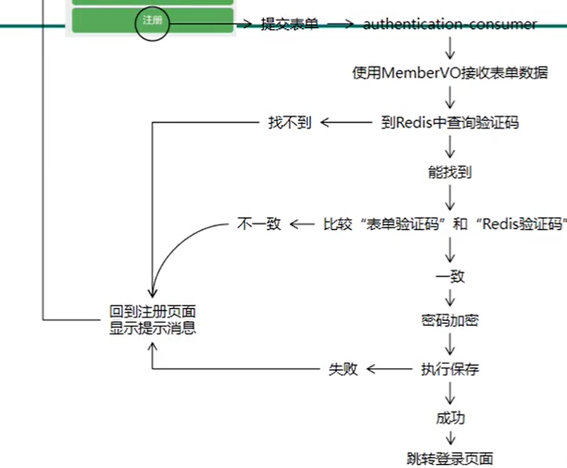
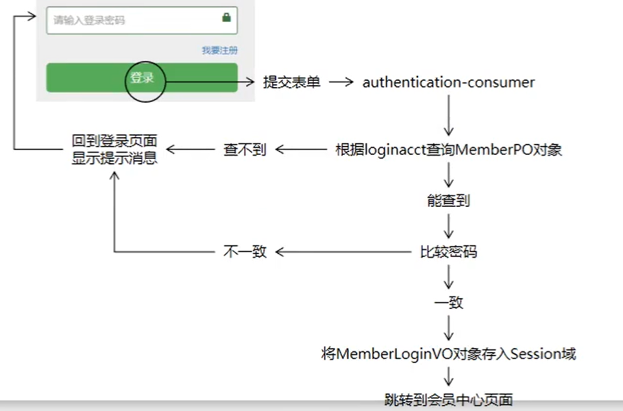
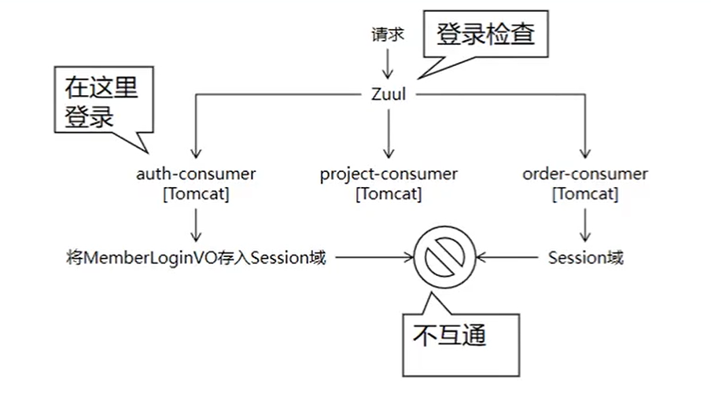
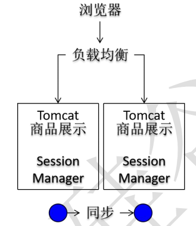
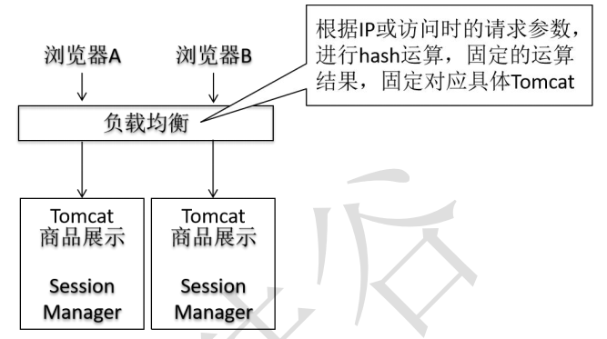

# 1. 注册

## 1.1 短信验证码

### 1.1.1 短信服务示例

```java
package com.aliyun.test;

import java.io.BufferedReader;
import java.io.IOException;
import java.io.InputStream;
import java.io.InputStreamReader;
import java.net.HttpURLConnection;
import java.net.MalformedURLException;
import java.net.URL;
import java.net.UnknownHostException;
import java.util.List;
import java.util.Map;

public class Tools {
    public static void main(String[] args) {
        String host = "http://smsmsgs.market.alicloudapi.com";  // 【1】请求地址 支持http 和 https 及 WEBSOCKET
        String path = "/smsmsgs"; // 【2】后缀
        String appcode = "你自己的AppCode"; // 【3】开通服务后 买家中心-查看AppCode
        String param = "123456";  // 【4】请求参数，详见文档描述
        String phone = "18030939917";  //  【4】请求参数，详见文档描述
        String sign = "175622";   //  【4】请求参数，详见文档描述
        String skin = "1";  //  【4】请求参数，详见文档描述
        String urlSend = host + path + "?param=" + param +"&phone="+phone +"&sign="+sign +"&skin="+skin;  // 【5】拼接请求链接
        try {
            URL url = new URL(urlSend);
            HttpURLConnection httpURLCon = (HttpURLConnection) url.openConnection();
            httpURLCon.setRequestProperty("Authorization", "APPCODE " + appcode);// 格式Authorization:APPCODE (中间是英文空格)
            int httpCode = httpURLCon.getResponseCode();
            if (httpCode == 200) {
                String json = read(httpURLCon.getInputStream());
                System.out.println("正常请求计费(其他均不计费)");
                System.out.println("获取返回的json:");
                System.out.print(json);
            } else {
                Map<String, List<String>> map = httpURLCon.getHeaderFields();
                String error = map.get("X-Ca-Error-Message").get(0);
                if (httpCode == 400 && error.equals("Invalid AppCode `not exists`")) {
                    System.out.println("AppCode错误 ");
                } else if (httpCode == 400 && error.equals("Invalid Url")) {
                    System.out.println("请求的 Method、Path 或者环境错误");
                } else if (httpCode == 400 && error.equals("Invalid Param Location")) {
                    System.out.println("参数错误");
                } else if (httpCode == 403 && error.equals("Unauthorized")) {
                    System.out.println("服务未被授权（或URL和Path不正确）");
                } else if (httpCode == 403 && error.equals("Quota Exhausted")) {
                    System.out.println("套餐包次数用完 ");
                } else {
                    System.out.println("参数名错误 或 其他错误");
                    System.out.println(error);
                }
            }

        } catch (MalformedURLException e) {
            System.out.println("URL格式错误");
        } catch (UnknownHostException e) {
            System.out.println("URL地址错误");
        } catch (Exception e) {
            // 打开注释查看详细报错异常信息
            // e.printStackTrace();
        }

    }

    /*
     * 读取返回结果
     */
    private static String read(InputStream is) throws IOException {
        StringBuffer sb = new StringBuffer();
        BufferedReader br = new BufferedReader(new InputStreamReader(is));
        String line = null;
        while ((line = br.readLine()) != null) {
            line = new String(line.getBytes(), "utf-8");
            sb.append(line);
        }
        br.close();
        return sb.toString();
    }
}
```

### 1.1.2 工具方法

```java
/**
 *
 * @param host  请求的地址
 * @param path  请求的后缀
 * @param appCode   购入的api的appCode
 * @param phoneNum  发送验证码的目的号码
 * @param sign      签名编号
 * @param skin      模板编号
 * @return          发送成功则返回发送的验证码，放在ResultEntity中，失败则返回失败的ResultEntity
 */
public static ResultEntity<String> sendCodeByShortMessage(
        String host,
        String path,
        String appCode,
        String phoneNum,
        String sign,
        String skin
){
    // 生成验证码
    StringBuilder builder = new StringBuilder();
    for (int i = 0; i < 4; i++){
        int random = (int)(Math.random()*10);
        builder.append(random);
    }
    String param = builder.toString();  
    String urlSend = host + path + "?param=" + param + "&phone=" + phoneNum + "&sign=" + sign + "&skin=" + skin;  
    try {
        URL url = new URL(urlSend);
        HttpURLConnection httpURLCon = (HttpURLConnection) url.openConnection();
        httpURLCon.setRequestProperty("Authorization", "APPCODE " + appCode);// 格式Authorization:APPCODE (中间是英文空格)
        int httpCode = httpURLCon.getResponseCode();
        if (httpCode == 200) {
            String json = read(httpURLCon.getInputStream());
            System.out.println("正常请求计费(其他均不计费)");
            System.out.println("获取返回的json:");
            System.out.print(json);
            return ResultEntity.successWithData(param);
        } else {
            Map<String, List<String>> map = httpURLCon.getHeaderFields();
            String error = map.get("X-Ca-Error-Message").get(0);
            if (httpCode == 400 && error.equals("Invalid AppCode `not exists`")) {
                return ResultEntity.failed("AppCode错误 ");
            } else if (httpCode == 400 && error.equals("Invalid Url")) {
                return ResultEntity.failed("请求的 Method、Path 或者环境错误");
            } else if (httpCode == 400 && error.equals("Invalid Param Location")) {
                return ResultEntity.failed("参数错误");
            } else if (httpCode == 403 && error.equals("Unauthorized")) {
                return ResultEntity.failed("服务未被授权（或URL和Path不正确）");
            } else if (httpCode == 403 && error.equals("Quota Exhausted")) {
                return ResultEntity.failed("套餐包次数用完 ");
            } else {
                return ResultEntity.failed("参数名错误 或 其他错误" + error);
            }
        }

    } catch (MalformedURLException e) {
        return ResultEntity.failed("URL格式错误");
    } catch (UnknownHostException e) {
        return ResultEntity.failed("URL地址错误");
    } catch (Exception e) {
         e.printStackTrace();
        return ResultEntity.failed("套餐包次数用完 ");
    }
}


/*
 * 读取返回结果
 */
private static String read(InputStream is) throws IOException {
    StringBuilder sb = new StringBuilder();
    BufferedReader br = new BufferedReader(new InputStreamReader(is));
    String line = null;
    while ((line = br.readLine()) != null) {
        line = new String(line.getBytes(), StandardCharsets.UTF_8);
        sb.append(line);
    }
    br.close();
    return sb.toString();
}
```

### 1.1.3 配置类

```java
@AllArgsConstructor
@NoArgsConstructor
@Data
@Component
// 给类设置在配置文件中设置时的前缀为“short.message”
@ConfigurationProperties(prefix = "short.message")
public class ShortMessageProperties {
    private String host;
    private String path;
    private String appCode;
    private String sign;
    private String skin;
}
```

### 1.1.4 application.xml

```yml
short:
  message:
    host: http://smsmsgs.market.alicloudapi.com
    path: /smsmsgs
    appCode: 略  
    sign: 略
    skin: 略
```

### 1.1.5 MemberHandler

```java
// 发送验证码
    @ResponseBody
    @RequestMapping("/auth/member/send/short/message.json")
    public ResultEntity<String> sendShortMessage(@RequestParam("phoneNum") String phoneNum){    
    // 调用工具类中的发送验证码的方法，可以从配置文件中读取配置的接口信息
    ResultEntity<String> sendResultEntity = CrowdUtil.sendCodeByShortMessage(
            shortMessageProperties.getHost(),
            shortMessageProperties.getPath(),
            shortMessageProperties.getAppCode(),
            phoneNum,
            shortMessageProperties.getSign(),
            shortMessageProperties.getSkin());

    // 判断-发送成功
    if (ResultEntity.SUCCESS.equals(sendResultEntity.getResult())){

        // 得到ResultEntity中的验证码
        String code = sendResultEntity.getData();

        // 将验证码存入到redis中（设置TTL，这里设置为5分钟）
        ResultEntity<String> redisResultEntity = redisRemoteService.setRedisKeyValueWithTimeoutRemote(
                CrowdConstant.REDIS_CODE_PREFIX + phoneNum, code, 5, TimeUnit.MINUTES);

        // 判断存入redis是否成功
        if (ResultEntity.SUCCESS.equals(redisResultEntity.getResult())){
            // 存入成功，返回成功
            return ResultEntity.successWithoutData();
        } else {
            // 存入失败，返回redis返回的ResultEntity
            return redisResultEntity;
        }
    } else {
        // 发送验证码失败，返回发送验证码的ResultEntity
        return sendResultEntity;
    }
}
```
## 1.6 执行注册思路



检测完**一致**后还得吧Redis里面的验证码删除。

## 1.7 注册代码

### 1.7.1 Api

```java
	//MySQL
	@RequestMapping("/get/member/by/login/acct/remote")
    ResultEntity<MemberPO> getMemberPOByLoginAcctRemote(@RequestParam("loginacct") String loginacct);

    @RequestMapping("/save/member/remote")
    ResultEntity<String> saveMemberRemote(@RequestBody MemberPO memberPO);
	//Redis
    @RequestMapping("/remove/redis/key/by/key/remote")
    ResultEntity<String> removeRedisKeyByKeyRemote(
            @RequestParam("key") String key
    );
```

### 1.7.2 MemberProviderHandler

```java
    @RequestMapping("/save/member/remote")
    public ResultEntity<String> saveMemberRemote(@RequestBody MemberPO memberPO){
        try {
            memberService.saveMember(memberPO);
            return ResultEntity.successWithoutData();
        } catch (Exception e){
            if (e instanceof DuplicateKeyException){
                return ResultEntity.failed(CrowdConstant.MESSAGE_SYSTEM_ERROR_LOGIN_NOT_UNIQUE);
            }
            return ResultEntity.failed(e.getMessage());
        }
    }
```

### 1.7.3 MemberService

```java
public interface MemberService {
	
	MemberPO getMemberPOByLoginAcct(String loginacct);
	
    void saveMember(MemberPO memberPO);
}
```

1.7.4 MemberServiceImpl

```java
@Transactional(readOnly = true)
@Service
public class MemberServiceImpl implements MemberService{
	
	@Autowired
	private MemberPOMapper memberPOMapper;

	public MemberPO getMemberPOByLoginAcct(String loginacct) {
		//1.创建Example对象
		MemberPOExample example = new MemberPOExample();
		//2.创建Criteria对象
		Criteria criteria = example.createCriteria();
		//3.封装查询条件
		criteria.andLoginAcctEqualTo(loginacct);
		//4.执行查询
		List<MemberPO> list = memberPOMapper.selectByExample(example);
		//5.返回结果
		return list.get(0);
	}
	
    @Transactional(propagation = Propagation.REQUIRES_NEW, rollbackFor = Exception.class)
    public void saveMember(MemberPO memberPO) {
            memberPOMapper.insertSelective(memberPO);
    }
}
```

### 1.7.4 MemberHandler

```java
// 进行用户注册操作
    @RequestMapping("/auth/member/do/register.html")
    public String doMemberRegister(MemberVO memberVO, ModelMap modelMap){
        // 获取手机号
        String phoneNum = memberVO.getPhoneNum();

        // 拼接为redis存放的key
        String key = CrowdConstant.REDIS_CODE_PREFIX + phoneNum;

        // 通过key寻找value（验证码）
        ResultEntity<String> resultEntity = redisRemoteService.getRedisValueByKeyRemote(key);

        String result = resultEntity.getResult();

        // 判断获取redis中的验证码是否成功
        if (ResultEntity.FAILED.equals(result)){
            // 失败，返回主页页面
            modelMap.addAttribute(CrowdConstant.ATTR_NAME_MESSAGE, resultEntity.getMessage());
            return "member-reg";
        }

        // 获取redis中的验证码的值
        String redisCode = resultEntity.getData();
        if (redisCode == null){
            modelMap.addAttribute(CrowdConstant.ATTR_NAME_MESSAGE,CrowdConstant.MESSAGE_CODE_NOT_EXIST);
            return "member-reg";
        }

        // 获取表单提交的验证码
        String formCode = memberVO.getCode();

        // 如果redis中的验证码与表单提交的验证码不同
        if (!Objects.equals(formCode,redisCode)){
            // request域存入不匹配的message
            modelMap.addAttribute(CrowdConstant.ATTR_NAME_MESSAGE,CrowdConstant.MESSAGE_CODE_INVALID);
            // 返回注册页面
            return "member-reg";
        }

        // 验证码比对一致，删除redis中的验证码数据
        redisRemoteService.removeRedisKeyByKeyRemote(key);

        // 进行注册操作

        // 1、加密
        BCryptPasswordEncoder bCryptPasswordEncoder = new BCryptPasswordEncoder();
        String formPwd = memberVO.getUserPswd();
        String encode = bCryptPasswordEncoder.encode(formPwd);

        // 2、将加密后的密码放入MemberVO对象
        memberVO.setUserPswd(encode);

        // 3、执行保存
        MemberPO memberPO = new MemberPO();
        BeanUtils.copyProperties(memberVO,memberPO);
        ResultEntity<String> saveResultEntity = mySQLRemoteService.saveMemberRemote(memberPO);

        // 4、判断保存是否成功
        String saveResult = saveResultEntity.getResult();
        if (ResultEntity.FAILED.equals(saveResult)){
            // 保存失败，则返回保存操作的ResultEntity中的message，存入request域的message
            modelMap.addAttribute(CrowdConstant.ATTR_NAME_MESSAGE, saveResultEntity.getMessage());
            // 回到注册页面
            return "member-reg";
        }

        // 全部判断成功，跳转到登录页面
        return "redirect:http://localhost/auth/to/member/login/page.html";
    }

```

## 1.8 Zuul

由于项目刚启动第一次进行redis操作时会比较慢，可能被ribbon认为是超时报错，因此通过下面的配置延长ribbon超时的时间

```yml
ribbon:
  ReadTimeout: 10000
  ConnectTimeout: 10000
```

# 2. 登录

## 2.1 思路



## 2.2 登录代码

### 2.2.1 LoginMemberVO

```java
@AllArgsConstructor
@NoArgsConstructor
@Data
public class LoginMemberVO implements Serializable {

    private Integer id;
    private String userName;
    private String email;
}
```

### 2.2.2 MemberHandler

```java
    // 登录操作
    @RequestMapping("/auth/do/member/login.html")
    public String doMemberLogin(
            @RequestParam("loginAcct") String loginAcct,
            @RequestParam("loginPswd") String loginPswd,
            ModelMap modelMap,
            HttpSession session) {

        // 远程方法调用，通过loinAcct，得到数据库中的对应Member
        ResultEntity<MemberPO> resultEntity = mySQLRemoteService.getMemberPOByLoginAcctRemote(loginAcct);

        // 判断-查询操作是否成功
        if (ResultEntity.FAILED.equals(resultEntity.getResult())){
            // 查询失败，返回登陆页面
            modelMap.addAttribute(CrowdConstant.ATTR_NAME_MESSAGE, resultEntity.getMessage());
            return "member-login";
        }

        // 查询操作成功，则取出MemberPO对象
        MemberPO memberPO = resultEntity.getData();

        // 判断得到的MemberPO是否为空
        if (memberPO == null){
            // 为空则返回登陆页面
            modelMap.addAttribute(CrowdConstant.ATTR_NAME_MESSAGE, CrowdConstant.MESSAGE_LOGIN_FAILED);
            return "member-login";
        }

        // 返回的MemberPO非空，取出数据库中的密码（已经加密的）
        String userPswd = memberPO.getUserPswd();

        // 使用BCryptPasswordEncoder，比对表单的密码与数据库中的密码是否匹配
        BCryptPasswordEncoder passwordEncoder = new BCryptPasswordEncoder();
        boolean matches = passwordEncoder.matches(loginPswd, userPswd);

        // 判断-密码不同
        if (!matches){
            // 返回登陆页面，存入相应的提示信息
            modelMap.addAttribute(CrowdConstant.ATTR_NAME_MESSAGE, CrowdConstant.MESSAGE_LOGIN_FAILED);
            return "member-login";
        }

        // 密码匹配，则通过一个LoginMemberVO对象，存入需要在session域通信的用户信息（这样只在session域放一些相对不私秘的信息，保护用户隐私）
        LoginMemberVO loginMember = new LoginMemberVO(memberPO.getId(), memberPO.getUserName(), memberPO.getEmail());

        // 将LoginMemberVO对象存入session域
        session.setAttribute(CrowdConstant.ATTR_NAME_LOGIN_MEMBER,loginMember);

        // 重定向到登陆成功后的主页面
        return "redirect:http://localhost/auth/to/member/center/page.html";
    }

    // 退出登录
    @RequestMapping("/auth/do/member/logout.html")
    public String doLogout(HttpSession session){
        // 清除session域数据
        session.invalidate();

        // 重定向到首页
        return "redirect:http://localhost/";
    }
```

## 2.3 Session共享

### 2.3.1 Session问题



### 2.3.2 Session共享

#### 2.3.2.1 Session同步



> 问题1:造成Session在各个服务器上“同量”保存。TomcatA保存了1G的Session数据，TomcatB也需要保存1G的Session数据。数据量太大的会导致Tomcat性能下降。
>
> 问题2:数据同步对性能有一定影响。

#### 2.3.2.2 Cookies存储

> 做法: 所有会话数据在浏览器端使用Cookie 保存，服务器端不存储任何会话数据。
>
> 好处: 服务器端大大减轻了数据存储的压力。不会有Session不一致问题
>
> 缺点:Cookie能够存储的数据非常有限。一般是4KB。不能存储丰富的数据。Cookie数据在浏览器端存储，很大程度上不受服务器端控制，如果浏览器端清理Cookie，相关数据会丢失。

#### 2.3.2.3 反向代理hash一一致性



> 问题1:具体一个浏览器，专门访问某一个具体服务器，如果服务器宕机，会丢失数据。存在单点故障风险。
>
> 问题2:仅仅适用于集群范围内，超出集群范围，负载均衡服务器无效。

#### 2.3.2.4 后端统一存Session

> 后端存储Session数据时，一般需要使用Redis这样的内存数据库,而一般不采用MySQL这样的为系型数据库。
>
> 原因如下:
>
> Session数据存取比较频繁。内存访问速度快。
>
> Session有过期时间,Redis 这样的内存数据库能够比较方便实现过期释放。

## 2.4 登录检查

### 2.4.1 思路


### 2.4.2 依赖

在zuul和authentication-consumer中加入依赖：

```xml
<dependency>
    <groupId>org.springframework.boot</groupId>
    <artifactId>spring-boot-starter-data-redis</artifactId>
</dependency>
<dependency>
    <groupId>org.springframework.session</groupId>
    <artifactId>spring-session-data-redis</artifactId>
</dependency>
```

### 2.4.3 application.yml

```yml
  redis: 
    host: 192.168.2.215
  session: 
    store-type: redis
```

### 2.4.4 代码

#### 2.4.4.1 工具类

```java
public class AccessPassResources {

    // 保存不被过滤的请求
    public static final Set<String> PASS_RES_SET = new HashSet<String>();

    // 静态代码块中加入不被过滤的内容
    static {
        PASS_RES_SET.add("/");
        PASS_RES_SET.add("/auth/to/member/reg/page.html");
        PASS_RES_SET.add("/auth/to/member/login/page.html");
        PASS_RES_SET.add("/auth/member/send/short/message.json");
        PASS_RES_SET.add("/auth/member/do/register.html");
        PASS_RES_SET.add("/auth/do/member/login.html");
        PASS_RES_SET.add("/auth/do/member/logout.html");
        PASS_RES_SET.add("/error");
        PASS_RES_SET.add("/favicon.ico");
    }

    // 保存不被过滤的静态资源
    public static final Set<String> STATIC_RES_SET = new HashSet<String>();

    // 静态代码块中加入不被过滤的内容
    static {
        STATIC_RES_SET.add("bootstrap");
        STATIC_RES_SET.add("css");
        STATIC_RES_SET.add("fonts");
        STATIC_RES_SET.add("img");
        STATIC_RES_SET.add("jquery");
        STATIC_RES_SET.add("layer");
        STATIC_RES_SET.add("script");
        STATIC_RES_SET.add("ztree");
    }

    /**
     *
     * @param servletPath 当前请求的路径 就是localhost:8080/aaa/bbb/ccc中的 “aaa/bbb/ccc”
     * @return true: 表示该资源是静态资源; false: 表示该资源不是静态资源
     */
    public static boolean judgeIsStaticResource(String servletPath){

        // 先判断字符串是否为空
        if (servletPath == null || servletPath.length() == 0){
            throw new RuntimeException(CrowdConstant.MESSAGE_STRING_INVALIDATE);
        }

        // 通过“/”来分割得到的请求路径
        String[] split = servletPath.split("/");

        // split[0]是一个空字符串，因此取split[1]，相当于/aaa/bbb/ccc的“aaa”
        String path = split[1];

        // 判断是否包含得到的请求的第一个部分
        return STATIC_RES_SET.contains(path);
    }
}
```

#### 2.4.4.2 Filter

```java
@Component
public class CrowdAccessFilter extends ZuulFilter {
    
    // return "pre" 表示在请求发生其前进行过滤
    @Override
    public String filterType() {
        return "pre";
    }

    @Override
    public int filterOrder() {
        return 0;
    }

    /**
     *
     * @return true:表示被拦截; false: 表示放行
     */
    @Override
    public boolean shouldFilter() {

        // 通过getCurrentContext得到当前的RequestContext
        RequestContext requestContext = RequestContext.getCurrentContext();

        // 通过RequestContext得到HttpServletRequest
        HttpServletRequest request = requestContext.getRequest();

        // 获得当前请求的路径
        String servletPath = request.getServletPath();

        // 判断当前请求路径是否包含在不被过滤的请求的set集合中
        boolean isPassContains = AccessPassResources.PASS_RES_SET.contains(servletPath);

        // 如果包含在set中，返回false，表示不被过滤
        if (isPassContains){
            return false;
        }

        // 判断是否是静态资源
        boolean isStaticResource = AccessPassResources.judgeIsStaticResource(servletPath);

        // 是静态资源则工具方法返回true，因为应该放行，所以取反，返回false
        return !isStaticResource;
    }

    @Override
    public Object run() throws ZuulException {

        // 通过getCurrentContext得到当前的RequestContext
        RequestContext requestContext = RequestContext.getCurrentContext();

        // 通过RequestContext得到HttpServletRequest
        HttpServletRequest request = requestContext.getRequest();

        // 得到session
        HttpSession session = request.getSession();

        // 从session中得到“loginMember”
        Object loginMember = session.getAttribute(CrowdConstant.ATTR_NAME_LOGIN_MEMBER);

        // 判断得到的loginMember是否为空
        if (loginMember == null){
            // 为空 取得response，为了后面进行重定向
            HttpServletResponse response = requestContext.getResponse();

            // 向session域中存放"message":"还未登录，禁止访问受保护资源！",为了在重定向后能够在前台显示错误信息
            session.setAttribute(CrowdConstant.ATTR_NAME_MESSAGE, CrowdConstant.MESSAGE_ACCESS_FORBIDDEN);
            
            try {
                // 重定向到登录页面
                response.sendRedirect("/auth/to/member/login/page.html");
            } catch (IOException e) {
                e.printStackTrace();
            }
        }

        // 返回null就是不操作
        return null;
    }
}
```

